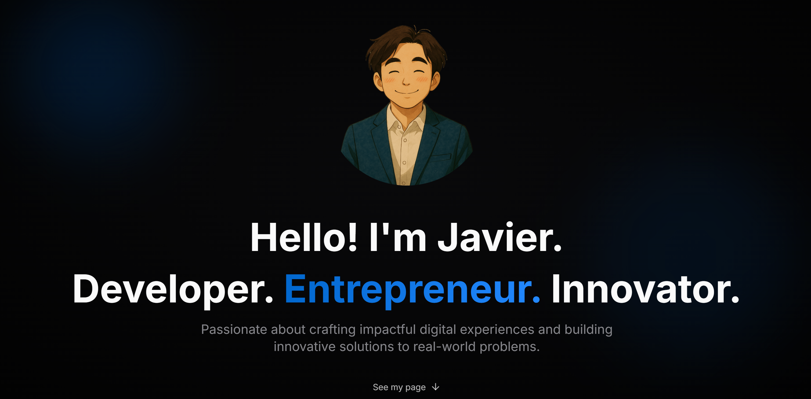

# Javier's Portfolio Website

A modern, responsive personal portfolio website showcasing my professional journey, projects, and skills.



## 🚀 Features

- **Responsive Design**: Looks great on all devices
- **Modern UI**: Built with Tailwind CSS and Shadcn UI components
- **Interactive Sections**: Showcase experience, projects, awards, and more
- **Contact Form**: Allow visitors to get in touch
- **Performance Optimized**: Fast loading times and smooth animations

## 🛠️ Tech Stack

- **Framework**: React 18
- **Language**: TypeScript
- **Styling**: Tailwind CSS
- **UI Components**: Shadcn UI
- **Build Tool**: Vite
- **Database**: Supabase (for email collection)
- **Deployment**: Vercel

## 📋 Project Structure
```
project-structure
├── public/
│   ├── images/
│   └── favicon.ico
├── src/
│   ├── components/ # UI components
│   ├── pages/ # Page components
│   ├── lib/ # Utility functions
│   ├── assets/ # Static assets
│   └── App.tsx # Main app component
├── tailwind.config.js
├── tsconfig.json
├── vite.config.ts
└── package.json
```


## 🔧 Getting Started

### Prerequisites

- Node.js (v16 or higher)
- npm or yarn

### Installation

1. Clone the repository
```bash
    git clone https://github.com/yourusername/dev-page.git
    cd dev-page
```

2. Install dependencies
```bash
    npm install
    # or
    yarn install
```

3. Set up environment variables
```bash
    cp .env.example .env.local
```
    Edit `.env.local` with your Supabase credentials.

4. Start the development server
```bash
    npm run dev
    # or
    yarn dev
```

## 🖥️ Development

The site will be running at `http://localhost:5173`.

### Building for Production

```bash
npm run build
# or
yarn build
```

## 📤 Deployment

This project is configured for easy deployment on Vercel:

1. Push your code to GitHub
2. Import the repository in Vercel
3. Configure environment variables
4. Deploy!

## 📝 License

This project is licensed under the MIT License - see the LICENSE file for details.

## 👤 Contact

Feel free to reach out if you have questions or feedback about this project.

[Email](mailto:javier.lim@u.nus.edu) | [LinkedIn](https://linkedin.com/in/jav-lim) | [GitHub](https://github.com/javierlimt6)